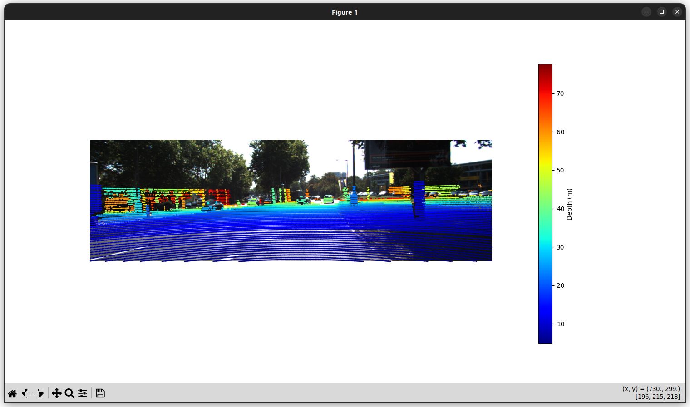
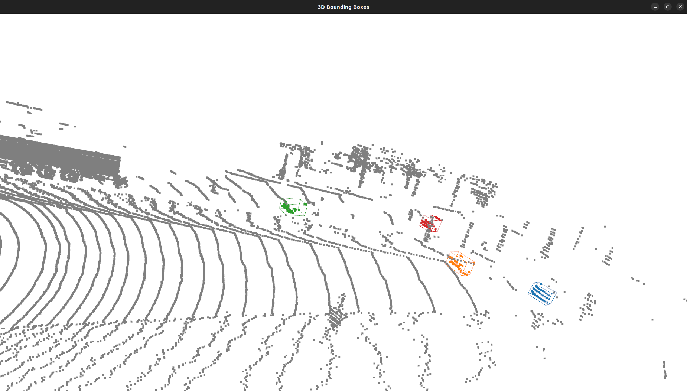

# Sensor Fusion for 3D Object Detection


## Contents

- [Introduction](#introduction)
- [Depdencies](#dependencies)
- [Setup](#setup)
- [Usage](#run-instructions)
- [References](#acknowledgement)

## Introduction

This project focuses on LiDAR-Camera sensor fusion and 3D object detection from a subset of KITTI Dataset. 

It involves data analysis, projecting the lidar points on to the image plane via sensor fusion, 3D object detection with the help of a process called Frustum Culling and perform Bounding Box Estimation.

The code files are as follows:

- `starter.py` & `dataloader.py` contains helper functions to load and visualize lidar, camera, calibration data and label information.
- `sensor_fusion.py` utilises the information from the calib files and perform transformation calculations to project the lidar points on to the image plane.
- `data_association.py` contains the data association functions that help peform the 3d object detection, bounding box formation and frustum culling process to extract the 3d points of the object. 
- `main.py` contains the final script that executes all the pre-defined functions and visualizes the output with the bounding box around the cars i.e. 3d objects.

## Dependencies

- numpy, matplotlib, open3D
- You can install all the requirements using `requirements.txt`

## Setup

Clone the repository:

```bash
git clone https://github.com/Madhav2133/sensor_fusion_object_detection.git
```

You can install the dependencies using a virtual environment (optional)

```bash
# Create a virtual environment (optional)
python3 -m venv env

# Activate the virtual environment
source env/bin/activate

# Install the requirements
pip3 install -r requirements.txt
```

## Run Instructions

Pretty simple, open your terminal and type:

```bash
python3 main.py --idx 000121
```

--idx: index is a parse argument we are giving to the main script, that helps it in choosing which data element you wanna consider.




## Acknowledgement

This is based on a past course project that I worked on during my masters at UMD. Course: `ENPM818Z On Road Automated Vehicles`. Due to it being a group project, I have only worked on a few aspects, so I wanted to redo the project wholely by myself.

Original project repository: [Automated Vehicles](https://github.com/siddhant-code/automated_vehicles.git)

Link to dataset: [Dataset](https://drive.google.com/drive/folders/18rizSz8nZbSk4g-5ing6CUKQiGT8vfeq?usp=sharing)